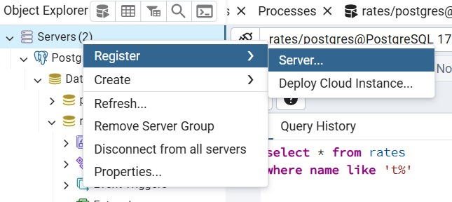

# HOW I LEARN: connect my code to a remote database

---

## Motivation: 

my initial idea for this project was to save the data in a `.csv` file. 

However, I later decided to switch to a PostgreSQL database, 
so I had to transfer the existing data from the .csv file to my new database.

Could I just ChatGPT to insert everthing? YES, but that wouldn't be much fun.

---

## FIRST STEP: Create the server

The image below shows how to do it:

- On the **General** tab, give your server a name;
- On the **Connections** tab:
  - enter your IP address in Host name/address field;
  - Create a password and check the `Save passwold?`;
- So save it and it's done; *happy face*

### HOW TO DISCOVER YOUR IP:
1. Open CMD
2. use the `ipconfig` command
3. Your IP address is on the line labeled `IPv4 address`.

---

## SECOND STEP: Configure PostgreSQL

Originally, PostgreSQL has some protection against remote access, 
so I had to change that to make him more _friendly_

### Files to change:

I found them in this directory: `C:\Program Files\PostgreSQL\'version'\data`

1. pg_hba.conf

In this file, I had to add a new line at the end

`host    all             all             0.0.0.0/0               md5`

- `host`: permits any remote connection;
- `all`(1º): means that  the rule applies to all databases;
- `all`(2º): means every user can access;
- `0.0.0.0/0` permits any IP connection;
- `md5`: It's a security encryption, to access the databases you need a md5 password;

> ⚠️ **Note**: It's dangerous use thi's IP permission, so I recommend use specific IPs, 
I'm reporting this because I learned it during my studies.

Example of specif IP permision:

`host    all             all             123.456.789.10/32               md5`

To give permission to a specific IP address, replace `0.0.0.0` with the IP you want to allow. The `/32` is a CIDR notation that means you're granting access to a single IP address.

why `/32`? This number, known as CIDR notation, defines the range of IP addresses that have access. A `/32` is used to allow a single, specific IP address.

The CIDR value can range from 32 down to 0. A simple rule of thumb is: the lower the number, the larger the range of IPs you're allowing. For example, `/24` gives access to 256 IPs, while `/16` opens it up to 65,536 IPs.

For a more detailed explanation of CIDR notation, you can check out this article: [Link about IP range - networkproguide.com](https://networkproguide.com/cidr-subnet-mask-ipv4-cheat-sheet/?utm_source=chatgpt.com)

2. postgresql.conf

Make sure the following line is set:

`listen_addresses = '*'`

In my case, it was already configured like that by default.

> ⚠️ **Note**: After making any changes, reset the PostgreSQL in Services.

---

## THIRD STEP: CONFIGURE THE FIREWALL

> ⚠️ **Note**: I make my project on Windows 11.

By default, Windows blocks external connections.

1. Open "Windows Defender Firewall with Advanced Security"(just search for it in the Start menu);
2. In the left panel, click Inbound Rules;
3. On the right, click "New Rule";
4. Select Port and click Next;
5. Select TCP, and in Specific local ports, type: 5432;
> 5432 is a common PostgreSQL port
6. Click Next, then choose Allow the connection;
7. In the next step, select all three options (Domain, Private, Public)
— or only what you need;
8. Give it a name and click Finish. The description is optional;

### Enable Ping (ICMP) Access (Optional)
Sometimes, when testing network access (like using ping), the firewall blocks the request.

To allow ping responses:

Still in Windows Defender Firewall with Advanced Security, go to Inbound Rules.

Search for the rule:

`File and Printer Sharing (Echo Request - ICMPv4-In)`

If it's disabled (no green checkmark), right-click and choose Enable Rule.

You might see more than one with the same name — enable all that apply to your network profile.

---

## THE END
With that I could access my database from another computer, now I gonna programming

I'm going to let a code with that 'Guide' for anyone see how to access a remote database

BYE

