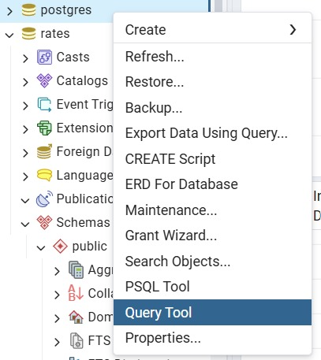
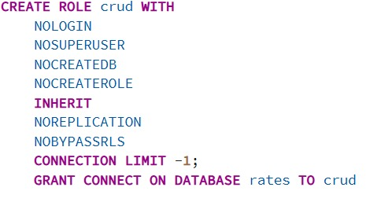
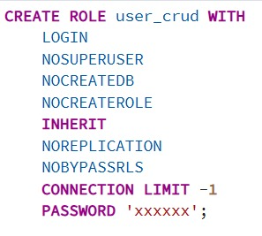
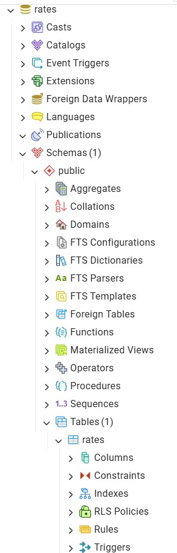
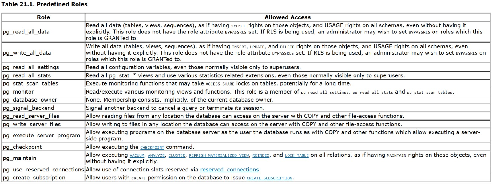

# HOW I LEARN: use users and roles PostgreSQL

For example, I will create a role for CRUD as example with a user.

---

## Motivation:

After digging into
[remote connections](https://github.com/CupOfCakes/renda-fixa-tracker/blob/staving/docs/remote%20database%20connection/READEME.md),
I realized the next logical step was 
setting up proper user management.
This lets me limit access, 
which is a huge step in securing the database and preventing any unwanted 'shenanigans'.

---

## FIRST STEP: Understand what a user is

Users are accounts that you create in your database to grant access. 
They are used to limit the user permissions.

Roles are default permissions for users, 
every user in the role gonna have his permissions

For example, you have a database for a project, and another person needs to read 
some lines, you create a user just for that purpose and give it to him.
That makes it more secure.

---

## SECOND STEP: Create the role

Open the query tools (SQL editor) of the database in which you want to create a user.

- First, give your user/role a name. In this example, I use the name `crud`;
- `NOLOGIN`: differentiates between a role and a user, means it's not a user
because you can't log in to it like an account. TO create a user, use `LOGIN`;
- `NOSUPERUSER`: A superuser is an admin. Be careful with this;
- `NOCREATEDB`: means that this role cannot create databases (the name is self-explanatory);
- `NOCREATEROLE`: means that this role cannot create others roles;
- `INHERIT`: means that this role has the permissions of the roles of which it is a member;
- `NOREPLICATION`: means this role cannot create a copy of the database, used for backups;
- `NOBYPASSRLS`: This role cannot break the security rules;
- `CONNECTION LIMIT -1;`: sets a connection limit; -1 means unlimited;
- `GRANT CONNECT ON DATABASE rates TO crud`: Grants permission to access the rates database;

Running this code will create a new role.

---

## THIRD STEP: Create the user

> Remember, in PostgreSQL, you can create user/role using the interface. 
> Just right-click on Login/Group Roles and select "Create/ Login/Group Role".

on the same query tools you can make the user with the code below

That's a user because there is a `LOGIN` and a `PASSWORD`.

## FOUR STEP: Give permissions to user/role

That's an example of code for granting CRUD permissions.

`GRANT SELECT, INSERT, UPDATE, DELETE ON ALL TABLES IN SCHEMA public TO crud;`

### Why SCHEMA public? 

You can notice that your database has schemas and tables, and "public" is the default schema.

---

# DEFAULT ROLES OF POSTGRESQL

You may notice PostgreSQL has some default roles. I tried to use them, but was unsuccessful.

Below is a table about these default roles, which can be found in the PostgreSQL documentation 
(which is downloaded when you download PostgreSQL).

___

# THE END

Maybe this is sad, but I have nothing to say in this end.

BYE~

