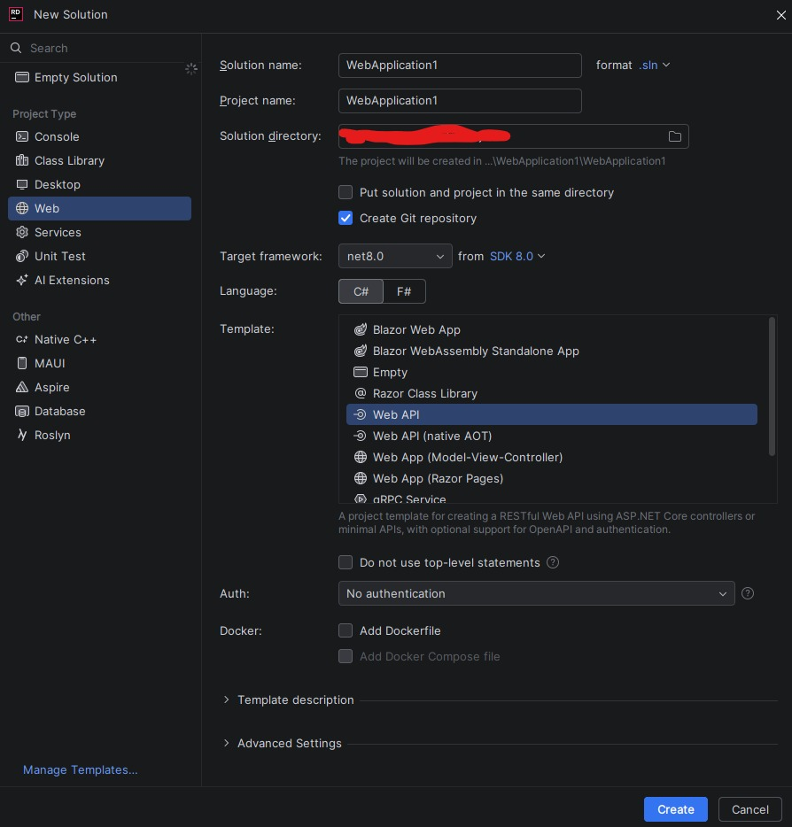
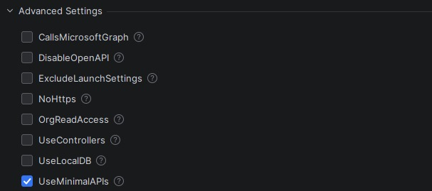
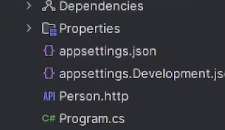

# ASP.NET para API - GUIA Introdutório

[](https://github.com/CupOfCakes) [](https://github.com/CupOfCakes/Amargor-Da-Vida) [](https://www.linkedin.com/in/heitor--carvalho/)

---

## O que é ASP.NET

**ASP.NET** é um framework da linguagem de programação **C#** com objetivo de criar **aplicações web**, principalmente **APIs**, que sera o foco dessa documentação.

---

## Motivação

Senti a necessidade de adicionar **APIs** às minhas habilidades, ampliando meu repertório de linguagens de programação. Com essa skill, posso criar projetos que envolvam múltiplas linguagens.  

Inicialmente, criei uma API em **FastAPI** pela sintaxe simples, mas, como estou me aprofundando em **C#**, decidi refazê-la em **ASP.NET**. Assim, pude aprender a sintaxe da linguagem sem precisar reinventar a lógica, que já havia sido implementada no projeto anterior.

> Nota: Para este projeto utilizei a **IDE Rider** e **dotnet 8**, pois queria conhecer e testar suas funcionalidades.

---

## Criando o projeto

Existem várias maneiras de se criar a base do projeto, aqui irei citar duas, pelo **terminal** e pela **IDE Rider**

### Terminal

```cmd
dotnet new webapi --name NomeDaAplicacao -minimal
```

Explicando o comando:

- **dotnet new webapi**: é o comando que ira criar a API;
- **--name NomeDaAplicacao**: aqui nomeamos a nossa API, no caso não coloquei nenhum nome especifico, não precisa usar aspas para colocar o nome;
- **-minimal**: indica que usaremos **Minimal API** nesse projeto.

> **Minimal API** é uma maneira de criar **HTTP APIs** com dependências e configurações minimas, assim facilitando o desenvolvimento. Está disponível apenas em versões do .**NET 7** ou superiores.

### IDE Rider



No **Rider** é necessário marcar:  

- Tipo do projeto como **Web**;
- Versão do **.NET**;
- Template **WebAPI**;
- Um nome de sua preferência.



Nas **configurações avançadas**, é possível selecionar **Minimal API**.

> O **Minimal API** vem ativo por padrão, mas não faz mal conferir

---

## Base do projeto

Após a criação do projeto, teremos os seguintes arquivos e pastas:



- **Dependencies**: pasta da **IDE Rider**, nela ficam os imports, frameworks e pacotes;
- **Properties**: contém o arquivo **lauchSettings.json**, ele define como o programa é executado. Por exemplo, é possível configurar para que a **API** abra o **swagger** automaticamente quando executada; 
- **appSettings.json**: é a configuração adicional geral do projeto;
- **appSettings.Development.json**: configuração adicional para **debug**;
- **Person.http**: arquivo para testar endpoints da API, define a porta e algumas outras configurações. Não é essencial para a execução do projeto;
- **Program.cs**: é a main do programa, aonde o projeto se inicia.

> A imagem foi retirado de um vídeo do YouTube (link no final do documento) pois precisava de uma versão nova pra explicar os arquivos.
> O arquivo .http vem com o nome do projeto.

> Quando o projeto é criado ele vem com uma rota de exemplo, pode excluir ela sem problemas.

---

## Configurações no Program.cs

```c#
var builder = WebApplication.CreateBuilder(args);

builder.Services.AddEndpointsApiExplorer();
builder.Services.AddSwaggerGen();

var app = builder.Build();

app.UseCors("AllowFront");

if (app.Environment.IsDevelopment())
{
    app.UseSwagger();
    app.UseSwaggerUI();
}


app.ADV_Routes();

app.UseHttpsRedirection();
app.Run();
```

Vamos entender parte a parte desse codigo:

- **builder**: é o construtor da **API**. Ele não executa a aplicação, mas permite pré-configurar serviços e funcionalidades. Neste código, definimos que teremos **endpoints** e **Swagger**.
- **app**: é o objeto que representa a aplicação em execução. É nele que finalizamos as configurações antes de iniciar a API.
  - `if (app.Environment.IsDevelopment())`: verifica se a aplicação está no **modo de desenvolvimento(debug)**; se verdadeiro, ativa o **Swagger** e a **SwaggerUI**.
- **UseCors("AllowFront")** configura o **CORS**, permitindo que a **API** seja acessada por outros sites;
- **ADV_Routes()**: método usado para organizar as rotas em outro arquivo. É possível colocar todas as rotas no próprio **Program.cs**, mas separá-las melhora a organização do projeto.
- **UseHttpsRedirection()**: força o redirecionamento para HTTPS, garantindo que a aplicação seja acessada de forma segura.
- **Run()**: inicia a execução da aplicação. Sem ele, o projeto não roda.

---

## Criando Rotas

Durante a criação de rotas, configuramos métodos como **GET, POST, PUT/PATCH** e **DELETE**. Esses métodos indicam a **intenção da requisição**, mas não fazem nada por si só; quem realmente dita o que acontece é o **código da rota**.

Abaixo um dicionario dos metodos:

| Método |       Intenção       |
| :----: | :------------------: |
|  GET   |   Retorno de dados   |
|  POST  |  Inserção de dados   |
|  PUT   | Atualização completa |
| PATCH  | Atualização parcial  |
| DELETE |   Deleção de dados   |


### GET

```c#
using System.Reflection;

app.MapGet("/produtos", (string? tipo) =>
        {
            var cardapio = Gets.CarregarCardapio();

            if (cardapio == null)
            {
                return Results.NotFound(new { detail = "Produtos não encontrado" });
            }

            if (tipo != null)
            {
                var prop = typeof(Cardapio).GetProperty(tipo, BindingFlags.IgnoreCase | 
                                                                BindingFlags.Public | 
                                                                BindingFlags.Instance);

                if (prop == null) return Results.NotFound(new { detail = $"Desculpe, não vendemos '{tipo}' AINDA." });
                
                var produtos = prop.GetValue(cardapio);
                return Results.Ok(produtos);
            }

            return Results.Ok(cardapio);

        });
```

> Este código de exemplo retorna produtos do meu projeto.

Explicando o funcionamento:

- **Tipo de rota**: nesse caso, **GET**, definido pelo `MapGet`.
- **URL**: aqui é `"/produtos"`.
- **Parâmetros**: `(string? tipo)` é um parâmetro opcional enviado pela requisição. No exemplo, ele é usado para filtrar categorias específicas de produtos. O nome `tipo` foi escolhido por mim, mas você pode usar qualquer outro.
- **Bloco de código**: dentro do `() => { ... }` está a lógica da rota.
- **Returns**: sempre usamos `Results` com métodos como `Ok` e `NotFound` para definir o **código HTTP** retornado. Por exemplo, `NotFound` retorna **404**, e `Ok` retorna **200**. O parâmetro passado é geralmente um **JSON**.
- **Conversão automática**: é possível retornar diretamente uma **classe**; o C# converte automaticamente para JSON.

Escolhi esse exemplo porque ele usa o parâmetro `tipo` e vários `returns`, permitindo explicar vários conceitos de forma prática.

### POST

```c#
app.MapPost("/compra", (Compra compra) => 
            RoutesHelper.SalvarGenerico(compra, Posts.SalvarCompra, "compra"));
```

O importante sobre **POST** (válido também para **PUT**, **PATCH** e **DELETE**) é que é aconselhável receber o JSON enviado pelo cliente como uma **classe**, pois a conversão é feita automaticamente e facilita a manipulação dos dados.

---

## Detalhes nas Classes

> Os exemplos a seguir consideram o uso de **JSON**.

Durante a conversão de dados JSON para objetos, é possível que alguns atributos retornem **null**, mesmo quando os dados existem. Isso acontece porque a conversão é feita com base no **nome dos atributos**.

Se o nome do atributo no JSON for diferente do nome definido na classe, a desserialização falha. Para evitar esse problema, utilize o atributo `[JsonPropertyName("nome_no_json")]` acima da propriedade da classe, indicando explicitamente qual campo do JSON ela deve mapear.

Por padrão, a desserialização utiliza o **construtor padrão** da classe. Caso existam múltiplos construtores, é necessário manter um construtor vazio (`public ClassName() {}`).

Se for preciso usar um construtor específico durante a conversão do JSON, é possível indicá-lo utilizando o atributo `[JsonConstructor]` acima do construtor desejado.

> **Lembrete**: Em **C#**, o uso de `?` indica que o atributo pode ser **null**, isso é útil para campos opcionais

---

# Conclusão

Nesta documentação foram abordados os conceitos fundamentais para a criação de uma **API com ASP.NET**, desde a motivação para o uso de APIs até a configuração do projeto, estrutura de arquivos, criação de rotas e detalhes importantes na manipulação de classes e JSON.

Com esse conteúdo, já é possível criar e organizar uma API funcional, entendendo como o framework funciona e como estruturar o código de forma clara e eficiente. A partir daqui, é possível evoluir o projeto adicionando novas funcionalidades, como persistência de dados, autenticação e melhorias na validação.


